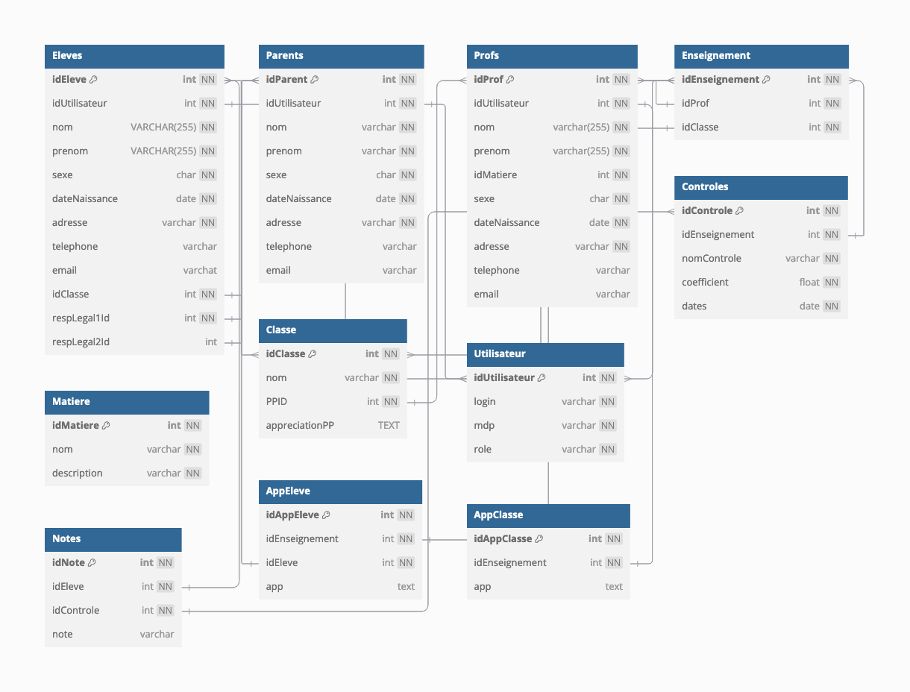

# Pronote
Développement d'un site web __inspiré de Pronote__ (limitée aux fonctionnalités de gestion des notes) dans le cadre du projet de NSI 2024, effectué lors de la dernière année au lycée Descartes de Montigny.

## Fonctionnalités implémentées
- **Élèves :**
    - Consultation de leurs informations personnelles
    - Accès à leur relevé de notes, trié par date (notes les plus récentes) ou par matière
    - Accès aux appréciations
- **Parents :**
    - Consultation de leurs propres informations personnelles ainsi que celles de leurs enfants
    - Accès aux notes de leurs enfants, triées par date (notes les plus récentes) ou par matière, pour chaque enfant
    - Consultation des relevés de notes de leurs enfants, triés par date (notes les plus récentes) ou par matière, pour chaque enfant
- **Professeurs :**
    - Consultation de leurs informations personnelles
    - Accès à la liste des élèves par classe
    - Possibilité de saisir des notes pour chaque élève (entre 0 et 20), ainsi que des indications telles que "A" pour absent, "D" pour dispensé, ou "N" pour non noté
    - Visualisation complète du relevé de notes de chaque élève, avec la possibilité d’ajouter directement une appréciation pour sa matière
    - Possibilité de saisir des appréciations spécifiques pour chaque élève ou des appréciations générales pour chaque classe enseignée

## Compte de démonstration
| Élève | Parent             | Professeur       |
|-----------|--------------------|------------------|
| _id :_ eleve_demo| _id :_ parent_demo | _id :_ prof_demo |
| _mdp :_ demoEleve | _mdp :_ demoParent | _mdp :_ demoProf |

## Schéma de la base de données


## Requêtes SQL pour la base de données `pronote.bdd`
```
CREATE TABLE IF NOT EXISTS Eleves (
	idEleve INT NOT NULL PRIMARY KEY AUTO_INCREMENT,
	idUtilisateur INT NOT NULL,
	nom VARCHAR (255) NOT NULL,
	prenom VARCHAR (255) NOT NULL,
	sexe VARCHAR (1) NOT NULL,
	dateNaissance DATE NOT NULL,
	adresse VARCHAR (255) NOT NULL,
	telephone VARCHAR (14),
	email VARCHAR (255),
	idClasse INT NOT NULL,
	respLegal1Id INT NOT NULL,
	respLegal2Id INT);

CREATE TABLE IF NOT EXISTS Parents (
	idParent INT NOT NULL PRIMARY KEY AUTO_INCREMENT,
	idUtilisateur INT NOT NULL,
	nom VARCHAR (255) NOT NULL,
	prenom VARCHAR (255) NOT NULL,
	sexe VARCHAR (1) NOT NULL,
	dateNaissance DATE NOT NULL,
	adresse VARCHAR (255) NOT NULL,
	telephone VARCHAR (14),
	email VARCHAR (255));

CREATE TABLE IF NOT EXISTS Profs (
	idProf INT NOT NULL PRIMARY KEY AUTO_INCREMENT,
	idUtilisateur INT NOT NULL,
	nom VARCHAR (255) NOT NULL,
	prenom VARCHAR (255) NOT NULL,
	idMatiere INT NOT NULL,
	sexe VARCHAR (1) NOT NULL,
	dateNaissance DATE NOT NULL,
	adresse VARCHAR (255) NOT NULL,
	telephone VARCHAR (14),
	email VARCHAR (255));

CREATE TABLE IF NOT EXISTS Enseignement (
	idEnseignement INT NOT NULL PRIMARY KEY AUTO_INCREMENT,
	idProf INT NOT NULL,
	idClasse INT NOT NULL);

CREATE TABLE IF NOT EXISTS Matiere (
	idMatiere INT NOT NULL PRIMARY KEY AUTO_INCREMENT,
	nom VARCHAR (255) NOT NULL,
	description VARCHAR (255) NOT NULL);

CREATE TABLE IF NOT EXISTS Classe (
	idClasse INT NOT NULL PRIMARY KEY AUTO_INCREMENT,
	nom VARCHAR (255) NOT NULL,
	PPID INT NOT NULL,
	appreciationPP TEXT);

CREATE TABLE IF NOT EXISTS Utilisateur (
	idUtilisateur INT NOT NULL PRIMARY KEY AUTO_INCREMENT,
	login VARCHAR (255) NOT NULL,
	mdp VARCHAR (255) NOT NULL,
	role VARCHAR (255) NOT NULL);

CREATE TABLE IF NOT EXISTS Controles (
	idControle INT NOT NULL PRIMARY KEY AUTO_INCREMENT,
	idEnseignement INT NOT NULL,
	nomControle VARCHAR (255) NOT NULL,
	coefficient FLOAT NOT NULL,
	dates DATE NOT NULL);

CREATE TABLE IF NOT EXISTS Notes (
	idNote INT NOT NULL PRIMARY KEY AUTO_INCREMENT,
	idEleve INT NOT NULL,
	idControle INT NOT NULL,
	note VARCHAR(5));

CREATE TABLE IF NOT EXISTS AppEleve (
	idAppEleve INT NOT NULL PRIMARY KEY AUTO_INCREMENT,
	idEnseignement INT NOT NULL,
	idEleve INT NOT NULL,
	app TEXT);

CREATE TABLE IF NOT EXISTS AppClasse (
	idAppClasse INT NOT NULL PRIMARY KEY AUTO_INCREMENT,
	idEnseignement INT NOT NULL,
	app TEXT);

INSERT INTO Eleves (idUtilisateur, prenom, nom, sexe, dateNaissance, adresse, telephone, email, idClasse, respLegal1Id, respLegal2Id) VALUES
     (1, 'Tony', 'DELHAYE', 'G', '2009-01-21', '2 avenue Philippine Diaz, Grenier 19414, France', '02 66 07 95 23', NULL, 1, 1, NULL),
     (2, 'Manon', 'DESCAMPS', 'F', '2009-04-01', '42 place Nathalie Gauthier, Dos Santos 48994, France', NULL, NULL, 3, 2, 3),
     (3, 'Aurélien', 'GRONDIN', 'G', '2009-11-03', '80 impasse Thibault, Lebon 41380, France', NULL, NULL, 2, 4, 5),
     (4, 'Alison', 'PAUL', 'F', '2009-08-04', '77 avenue Virginie Julien, Levyboeuf 08182, France', NULL, NULL, 1, 6, 7),
     (5, 'Laurie', 'BLOT', 'F', '2010-06-21', '11 boulevard Gallet, Payet 62546, France', '01 27 76 84 71', NULL, 2, 8, 9),
     (6, 'Agathe', 'FUCHS', 'F', '2010-12-02', '98 avenue François Clement, Thierry 86131, France', '01 34 24 14 12', NULL, 4, 10, 11),
     (7, 'Augustin', 'GRANGER', 'G', '2010-09-26', '7 rue de Duhamel, Mallet 75153, France', NULL, NULL, 4, 12, 13),
     (8, 'Julien', 'WANG', 'G', '2010-07-12', '61 rue Alphonse Marin, Roy-sur-Fouquet 25727, France', NULL, NULL, 3, 14, 15);

INSERT INTO Parents (idUtilisateur, prenom, nom, sexe, dateNaissance, adresse, telephone, email) VALUES
     (9, 'Isabelle', 'LECOMTE', 'F', '1974-01-05', '2 avenue Philippine Diaz, Grenier 19414, France', NULL, NULL),
     (10, 'Éric', 'DESCAMPS', 'M', '1973-02-12', '42 place Nathalie Gauthier, Dos Santos 48994, France', NULL, NULL),
     (11, 'Martine', 'DESCAMPS', 'F', '1968-07-28', '42 place Nathalie Gauthier, Dos Santos 48994, France', '02 66 98 63 05', NULL),
     (12, 'Jean', 'GRONDIN', 'M', '1969-03-12', '80 impasse Thibault, Lebon 41380, France', NULL, NULL),
     (13, 'Nathalie', 'GRONDIN', 'F', '1976-06-12', '80 impasse Thibault, Lebon 41380, France', '03 27 68 67 15', NULL),
     (14, 'Franck', 'PAUL', 'M', '1970-03-16', '77 avenue Virginie Julien, Levyboeuf 08182, France', NULL, NULL),
     (15, 'Camille', 'PAUL', 'F', '1985-01-26', '77 avenue Virginie Julien, Levyboeuf 08182, France', '06 80 77 56 53', NULL),
     (16, 'Jean-Pierre', 'BLOT', 'M', '1987-07-29', '11 boulevard Gallet, Payet 62546, France', NULL, NULL),
     (17, 'Sylviane', 'BLOT', 'F', '1983-12-23', '11 boulevard Gallet, Payet 62546, France', NULL, NULL),
     (18, 'Thierry', 'FUCHS', 'M', '1985-06-01', '98 avenue François Clement, Thierry 86131, France', '07 35 22 81 26', NULL),
     (19, 'Sandrine', 'FUCHS', 'F', '1985-05-25', '98 avenue François Clement, Thierry 86131, France', NULL, NULL),
     (20, 'Stanislas', 'GRANGER', 'M', '1968-03-17', '7 rue de Duhamel, Mallet 75153, France', NULL, NULL),
     (21, 'Marie-Ange', 'GRANGER', 'F', '1968-04-20', '7 rue de Duhamel, Mallet 75153, France', NULL, NULL),
     (22, 'Daniel', 'WANG', 'M', '1977-10-22', '61 rue Alphonse Marin, Roy-sur-Fouquet 25727, France', '07 68 98 55 35', NULL),
     (23, 'Christine', 'WANG', 'F', '1979-10-03', '61 rue Alphonse Marin, Roy-sur-Fouquet 25727, France', NULL, NULL);

INSERT INTO Profs (idUtilisateur, nom, prenom, sexe, dateNaissance, adresse, telephone, email, idMatiere) VALUES
     (24, 'AZZURRO', 'Giovanni', 'M', '1993-07-16', '75 avenue Tanguy, Leclercdan 90660, France', NULL, NULL, 1),
     (25, 'WEISS', 'Jéméry', 'M', '1975-05-05', '8 chemin de Roussel, Laurent 07268, France', NULL, NULL, 1),
     (26, 'RAMON', 'Stéphane', 'M', '1995-01-07', '83 rue Jeanne Laroche, Guibert 89991, France', NULL, NULL, 2),
     (27, 'DOUCET', 'Laure', 'F', '1971-05-25', '46 boulevard David, Guillaume-sur-Ribeiro 53881, France', '03 50 66 18 21', NULL, 2),
     (28, 'GAUDIN', 'Florence', 'F', '1988-02-15', '57 rue de Besnard, Joubert 78362, France', NULL, NULL, 3),
     (29, 'GALLET', 'Benjamin', 'M', '1962-04-02', '83 rue Robert Durand, Michaud-la-Forêt 14769, France', NULL, NULL, 3),
     (30, 'MARTINEZ', 'Laura', 'F', '1978-12-21', '27 impasse de Perez, Lamy 54160, France', NULL, NULL, 4),
     (31, 'ALVAREZ', 'Sabrina', 'F', '1989-06-25', '7 place Arnaud, Legrosnec 30563, France', '01 33 41 62 77', NULL, 4),
     (32, 'PUJOL', 'Philippe', 'M', '1977-08-18', '5 rue de Mahe, Marin-sur-Mer 75652, France', NULL, NULL, 5),
     (33, 'ROUX', 'Nawal', 'F', '1973-03-05', '4 boulevard Lucas Thomas, Gimenez 49249, France', '08 99 17 88 29', NULL, 5),
     (34, 'MILLOT', 'Pauline', 'F', '1982-10-06', '94 rue de Colin, Guilletnec 72343, France', '01 15 61 07 32', NULL, 6),
     (35, 'JOLY', 'Andrea', 'F', '1961-10-12', '369 boulevard de Renault, Voisin 32945, France', '04 93 13 58 64', NULL, 6),
     (36, 'CECCACI', 'Thomas', 'M', '1970-04-17', '9 chemin Bertrand, Chauvin 70164, France', '01 01 70 00 88', NULL, 7),
     (37, 'BROWN', 'Julie', 'F', '1983-04-17', '25 rue Patricia Clement, Le Gall 82519, France', '03 03 22 86 91', NULL, 7),
     (38, 'SIMON', 'Amandine', 'F', '1973-06-01', '68 rue Philippine Pottier, Renaud 85637, France', '09 83 27 06 62', NULL, 8),
     (39, 'LACAZE', 'Hugo', 'M', '1981-12-01', '80 rue Garnier, Gregoire 10825, France', '04 99 43 46 19', NULL, 8);

INSERT INTO Enseignement (idProf, idClasse) VALUES
     (1, 1), (1, 4),
     (2, 3), (2, 2),
     (3, 4), (3, 2),
     (4, 3), (4, 1),
     (5, 3), (5, 4),
     (6, 2), (6, 1),
     (7, 3), (7, 1),
     (8, 4), (8, 2),
     (9, 1), (9, 2),
     (10, 3), (10, 4),
     (11, 4), (11, 3),
     (12, 2), (12, 1),
     (13, 4), (13, 3),
     (14, 1), (14, 2),
     (15, 2), (15, 3),
     (16, 1), (16, 4);

INSERT INTO Matiere (nom, description) VALUES
     ('Maths','Mathématiques'),
     ('Fran','Français'),
     ('Ang','Anglais'),
     ('All','Allemand'),
     ('PC','Physique Chimie'),
     ('SVT','Sciences de la vie et de la Terre'),
     ('EPS','Éducation physique et sportive'),
     ('HG','Histoire Géographie');

INSERT INTO Classe (nom, PPId) VALUES
     ('3A', 4),
     ('3B', 8),
     ('4A', 12),
     ('4B', 10);

INSERT INTO Utilisateur (login, mdp, role) VALUES
     ('eleve_demo', 'demoEleve', 'Eleve'),
     ('mdescamps', 'mdescamps', 'Eleve'),
     ('agrondin', 'agrondin', 'Eleve'),
     ('apaul', 'apaul', 'Eleve'),
     ('lblot', 'lblot', 'Eleve'),
     ('afuchs', 'afuchs', 'Eleve'),
     ('agranger', 'agranger', 'Eleve'),
     ('jwang', 'jwang', 'Eleve'),
     ('ilecomte', 'ilecomte', 'Parent'),
     ('edescamps', 'edescamps', 'Parent'),
     ('mdescamps', 'mdescamps', 'Parent'),
     ('jgrondin', 'jgrondin', 'Parent'),
     ('ngrondin', 'ngrondin', 'Parent'),
     ('fpaul', 'fpaul', 'Parent'),
     ('parent_demo', 'demoParent', 'Parent'),
     ('jblot', 'jblot', 'Parent'),
     ('sblot', 'sblot', 'Parent'),
     ('tfuchs', 'tfuchs', 'Parent'),
     ('sfuchs', 'sfuchs', 'Parent'),
     ('sgranger', 'sgranger', 'Parent'),
     ('mgranger', 'mgranger', 'Parent'),
     ('dwang', 'dwang', 'Parent'),
     ('cwang', 'cwang', 'Parent'),
     ('gazzuro', 'gazzuro', 'Professeur'),
     ('jweiss', 'jweiss', 'Professeur'),
     ('sramon', 'sramon', 'Professeur'),
     ('ldoucet', 'ldoucet', 'Professeur'),
     ('fgaudin', 'fgaudin', 'Professeur'),
     ('bgallet', 'bgallet', 'Professeur'),
     ('lmartinez', 'lmartinez', 'Professeur'),
     ('salvarez', 'salvarez', 'Professeur'),
     ('ppujol', 'ppujol', 'Professeur'),
     ('nroux', 'nroux', 'Professeur'),
     ('pmillot', 'pmillot', 'Professeur'),
     ('ajoly', 'ajoly', 'Professeur'),
     ('tceccaci', 'tceccaci', 'Professeur'),
     ('jbrown', 'jbrown', 'Professeur'),
     ('asimon', 'asimon', 'Professeur'),
     ('prof_demo', 'demoProf', 'Professeur');

INSERT INTO Controles (idEnseignement, nomControle, coefficient, dates) VALUES
     (1, 'Évaluation sur les suites numériques', 1, '2023-05-23'),
     (8, 'Contrôle de grammaire', 2, '2023-07-26'),
     (17, 'DS sur les ondes', 1, '2024-11-02'),
     (3, 'Test4', 1, '2023-07-23'),
     (4, 'Test5', 1, '2024-12-13'),
     (4, 'Test6', 1, '2023-02-22'),
     (1, 'Évaluation sur les fonctions quadratiques', 2, '2024-02-09'),
     (2, 'Évaluation sur les fonctions usuelles', 1, '2024-05-02'),
     (14, 'Test 1', 1, '2024-05-07'),
     (17, 'Test 2', 3, '2024-05-11'),
     (24, 'Test 3', 4, '2024-05-24'),
     (31, 'Test 4', 4, '2024-05-03'),
     (27, 'Test 5', 2, '2024-05-01'),
     (12, 'Test 8', 0.25, '2024-04-09');

INSERT INTO Notes (idEleve, idControle, note) VALUES
     (1, 1, '13'),
     (1, 2, '17'),
     (1, 3, '7'),
     (2, 4, '18'),
     (3, 5, '4'),
     (3, 6, '12'),
     (4, 1, '20'),
     (4, 2, '5'),
     (4, 3, '10'),
     (5, 5, '16'),
     (5, 6, '9'),
     (8, 4, '2'),
     (1, 7, '16'),
     (4, 7, 'Abs'),
     (6, 8, '12'),
     (7, 8, '7'),
     (1, 9, '17.5'),
     (4, 9, '6'),
     (1, 10, '2'),
     (4, 10, 'N.Not'),
     (1, 11, '18'),
     (4, 11, '20'),
     (1, 12, '0'),
     (4, 12, '11'),
     (1, 13, 'Disp'),
     (4, 13, '9'),
     (1, 14, '20'),
     (4, 14, NULL);

INSERT INTO AppEleve (idEleve, idEnseignement) VALUES
     (1, 1), (1, 24), (1, 31), (1, 17), (1, 14), (1, 12), (1, 8),
     (1, 27), (2, 22), (2, 3), (2, 30), (2, 19), (2, 7), (2, 13), (2, 9), (2, 26),
     (3, 4), (3, 18), (3, 16), (3, 28), (3, 23), (3, 6), (3, 11), (3, 29),
     (4, 1), (4, 24), (4, 31), (4, 17), (4, 14), (4, 12), (4, 8), (4, 27),
     (5, 4), (5, 18), (5, 16), (5, 28), (5, 23), (5, 6), (5, 11), (5, 29),
     (6, 32), (6, 21), (6, 10), (6, 20), (6, 15), (6, 5), (6, 25), (6, 2),
     (7, 32), (7, 21), (7, 10), (7, 20), (7, 15), (7, 5), (7, 25), (7, 2),
     (8, 22), (8, 3), (8, 30), (8, 19), (8, 7), (8, 13), (8, 9), (8, 26);

INSERT INTO AppClasse (idEnseignement) VALUES
     (1), (2), (3), (4), (5), (6), (7), (8), (9), (10),
     (11), (12), (13), (14), (15), (16), (17), (18), (19), (20),
     (21), (22), (23), (24), (25), (26), (27), (28), (29), (30),
     (31), (32);
```