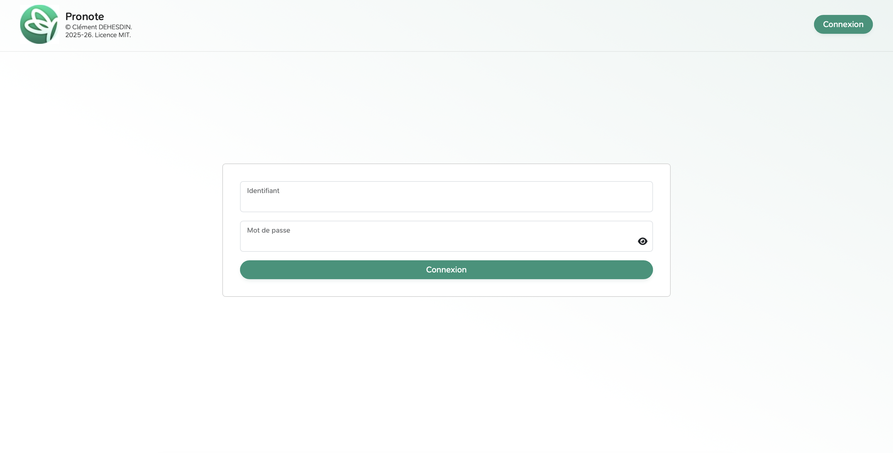
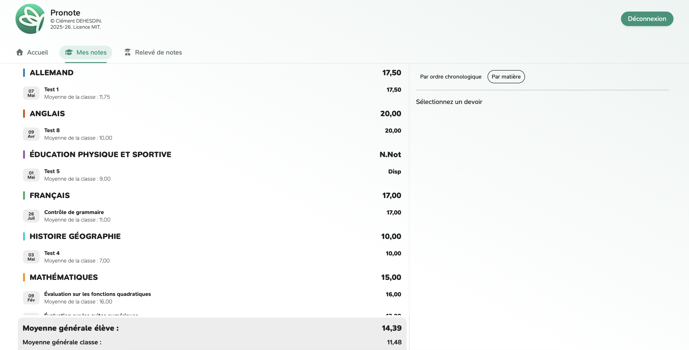
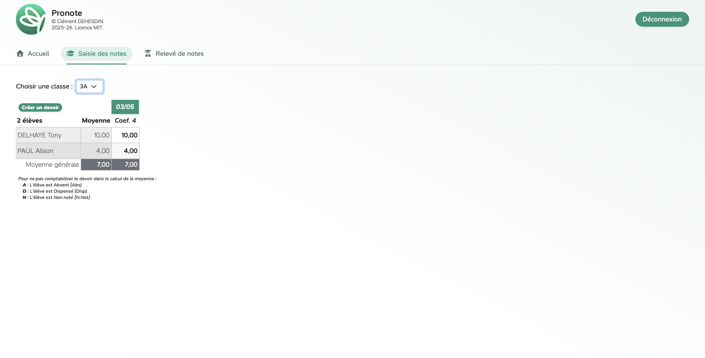

## Pronote

Développement d'un site web **inspiré de Pronote** limitée aux fonctionnalités de gestion des notes.

Ce projet a été initialement réalisé dans le cadre du projet de NSI 2024, durant la dernière année au lycée Descartes de Montigny.
Il a ensuite été **redesigné** en 2025, avec une **amélioration de la sécurité** et de l'ergonomie générale de l'application.

### Fonctionnalités

Un utilisateur disposant du rôle d'élève peut consulter ses informations personnelles directement depuis la page d'accueil. Il a également accès à son relevé de notes, qu'il peut trier soit par date soit par matière via la page **« Mes notes »**. Enfin, il peut consulter les appréciations associées à ses résultats sur la page **« Relevé de notes »**.

Un utilisateur ayant le rôle de parent bénéficie des mêmes fonctionnalités que l'élève, mais appliquées aux données de ses enfants. Cependant, dans les pages **« Les notes »** et **« Relevé de notes »**, un système de sélection lui permet de choisir l'enfant dont il souhaite afficher les résultats et les appréciations.

Un utilisateur disposant du rôle de professeur peut consulter ses informations personnelles depuis la page d’accueil. Il peut créer un devoir, modifier ses informations (nom, date et coefficient) et saisir les notes des élèves d’une classe sélectionnée via la page  **« Saisie des notes »**. Les notes peuvent être comprises entre 0 et 20 ou remplacées par des mentions spécifiques telles que A pour absent, D pour dispensé ou N pour non noté. Sur la page **« Saisie des appréciations »**, il peut visualiser l'ensemble du relevé de notes de chaque élève, ajouter une appréciation pour la matière qu'il enseigne, saisir des appréciations individuelles pour chaque élève.

#### Compte de démonstration
| Élève | Parent             | Professeur       |
|-----------|--------------------|------------------|
| _id :_ eleve_demo| _id :_ parent_demo | _id :_ prof_demo |
| _mdp :_ eleve_demo | _mdp :_ parent_demo | _mdp :_ prof_demo |

### Aperçu de l'application

<table>
  <thead>
    <tr>
      <th>Page</th>
      <th>Élève</th>
      <th>Parent</th>
      <th>Professeur</th>
    </tr>
  </thead>
  <tbody>
    <tr>
      <td>Page de connexion</td>
      <td colspan="3" align="center">
        
      </td>
    </tr>
    <tr>
      <td>Page « Notes »*</td>
      <td align="center">
        
      </td>
      <td align="center">
        
      </td>
      <td align="center">
        
      </td>
    </tr>
    <tr>
      <td>Relevé de notes</td>
      <td align="center"></td>
      <td align="center"></td>
      <td align="center"></td>
    </tr>
  </tbody>
</table>

###### *La page « Notes » est commune à tous les utilisateurs, mais son contenu et ses fonctionnalités varient en fonction du rôle (élève, parent ou professeur). Elle permet respectivement la consultation des notes, la sélection de l’enfant avec la consultation de ses notes, ou la saisie des notes.

### Utilisation

Pour utiliser l'application, il suffit de cloner le dépôt, lancer un serveur local incluant Apache et MySQL (comme XAMPP ou WAMP), configurer la base de données en important le fichier SQL `src/bdd.sql`, renseigner les paramètres de connexion à la base de données dans le fichier de configuration PHP `src/php/config.php`, puis accéder au site depuis un navigateur web.
